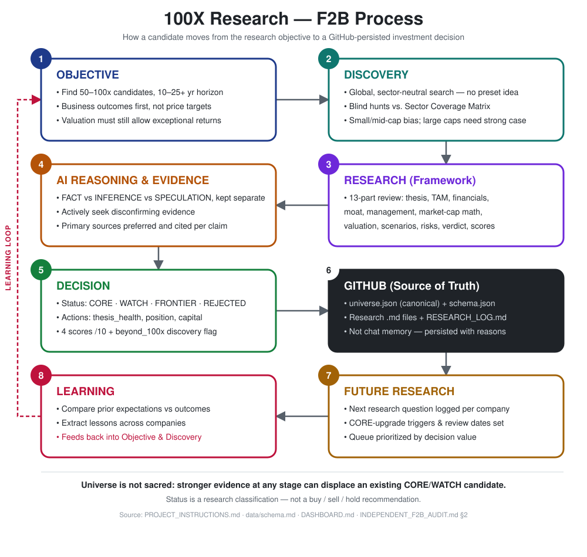

# 100X Investment Research

## What is 100X?

100X is a personal, long-term investment research project for studying listed companies that may have the potential to create exceptional shareholder value over 10–25+ years.

The goal is not to predict the next multibagger. The goal is to systematically ask what would have to be true for an exceptional outcome, examine the underlying business economics, and actively test the assumptions against evidence.

## The Core Question

**What would have to be true for a relatively small company today to become dramatically larger over the next 10–25+ years—and how realistic is that path?**

We start with business outcomes, not stock-price targets. We reverse-engineer the scale, revenue, profitability, market share and growth required for exceptional outcomes, then test whether those assumptions are realistic.

## Research Process

How a candidate moves from the research objective to a GitHub-persisted investment decision.

## How Companies Are Evaluated

- **Business Potential** — TAM, growth runway, scalability and long-term economics.
- **Probability of Success** — moat, management, execution, competitive position and financial strength.
- **Investment Attractiveness** — whether the current valuation appears to leave room for the hypothesised long-term outcome.
- **100X Mathematics** — a reverse-engineering exercise to understand the business scale and economics required for an exceptional outcome.
- **Failure Analysis** — actively looking for reasons the thesis may fail and evidence that contradicts it.

## Classifications

- **CORE** — High-priority research candidate with a comparatively stronger evidence base and a credible path to exceptional long-term business outcomes.
- **WATCH** — Interesting candidate that needs stronger evidence, better valuation support or further execution proof.
- **FRONTIER** — Very high potential, but extremely high uncertainty.
- **REJECTED** — Investigated and found not to meet the framework; the reason is retained for future reference.

These are **research classifications, not buy, sell or hold recommendations**.

## Beyond the 100X Framework

The primary framework explores plausible exceptional long-term outcomes. Occasionally, research may uncover a compelling case worth studying even when the strict 50–100X path is insufficient, uncertain or unproven.

**Beyond 100X is a discovery lens, not another classification or recommendation.**

## Principles

- Long-term horizon: **10–25+ years**
- Global and sector-neutral search
- Preference for smaller companies where exceptional scale-up is mathematically more feasible
- Business quality matters more than fashionable narratives
- Primary-source-led research where possible
- Clear separation of **fact, inference and speculation**
- No confirmation bias: actively seek disconfirming evidence
- The universe is not fixed; stronger new candidates can replace existing ones

## Important Disclaimer

100X is a **personal investment research project** created for private research and idea generation. The content reflects research views, hypotheses and interpretations at a particular point in time.

Nothing on this site should be construed as personalized investment advice or a recommendation to buy, sell or hold any security. Research classifications, scores, scenarios and 100X analyses are framework outputs intended to support independent research; they are not guarantees, forecasts or promises of investment returns.

Investing in securities involves substantial risk, including the possible loss of capital. Information may be incomplete or become outdated, and assumptions may prove incorrect. Past performance does not guarantee future results.

Anyone viewing this research should conduct their own due diligence and make independent decisions based on their own circumstances and risk tolerance.